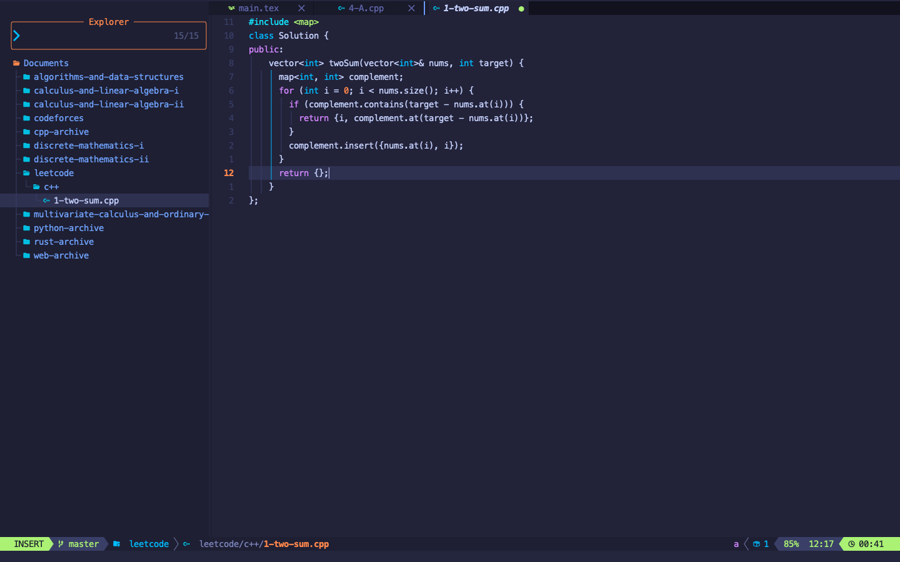
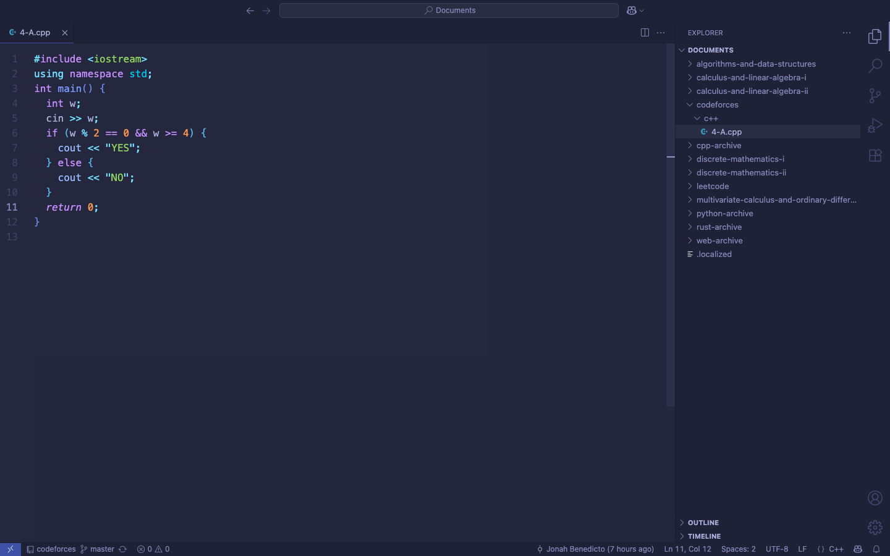

```rust
impl Solution {
    pub fn two_sum(nums: Vec<i32>, target: i32) -> Vec<i32> {
        let mut map = std::collections::HashMap::new();
        
        for (i, num) in nums.iter().enumerate() {
            let complement = target - num;
            
            if let Some(&index) = map.get(&complement) {
                return vec![index as i32, i as i32];
            }
            
            map.insert(num, i);
        }
        
        vec![]
    }
}

```






